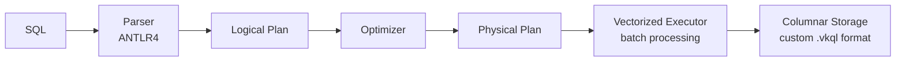
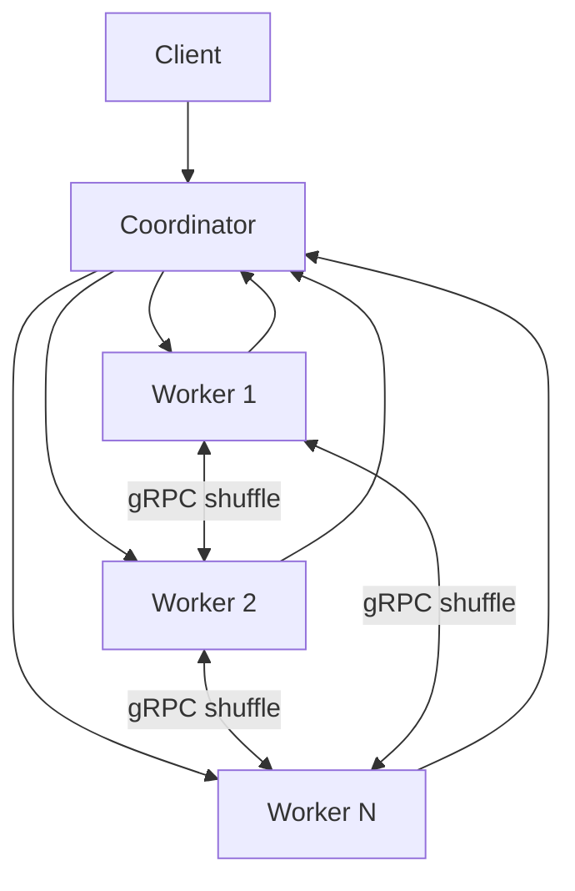

# vkSQL

A distributed analytical query engine built from scratch in Java 21 — columnar storage, vectorized execution, and distributed query planning designed to run TPC-H queries across multiple nodes.

## Architecture

### Query Processing Pipeline



### Distributed Execution



## Key Features

- **Columnar storage with zone maps** — min/max statistics per page for predicate pushdown
- **Vectorized execution** — batch-oriented processing operating on column vectors
- **Memory-mapped I/O** — zero-copy reads via Panama `MemorySegment` (Java 21 FFM API)
- **Parallel execution** — multi-threaded scan and aggregation with virtual threads
- **Hash join / aggregate** — in-memory hash-based operators for analytical queries
- **Predicate pushdown** — skip row groups and pages using zone map statistics
- **gRPC distributed execution** — shuffle data across worker nodes for distributed joins
- **Fault tolerance** — retry logic and partition reassignment on worker failure
- **Compression** — Snappy (fast) and Zstd (high ratio) block compression
- **Encoding** — Dictionary, RLE, and Delta encoding for columnar data

## Performance

Benchmarked on Apple M5 (10 cores), 16GB RAM, macOS 26.6.2, OpenJDK 21.0.12, ZGC.

### Storage Engine (100M rows)

| Metric | Throughput |
|--------|-----------|
| Single-thread scan + aggregate | **2.8 billion rows/sec** |
| Parallel execution (all cores) | **4.5 billion rows/sec** |

### TPC-H Queries (10M rows)

| Query | Description | Throughput |
|-------|-------------|------------|
| Q1 | Pricing Summary (scan + group-by agg) | **86.2 M rows/sec** |
| Q6 | Revenue Forecast (scan + filter + agg) | **67.1 M rows/sec** |
| Q12 | Shipping Modes (hash join + group-by) | **95.2 M rows/sec** |
| Q14 | Promotion Effect (hash join + computed agg) | **75.2 M rows/sec** |

See [docs/BENCHMARKS.md](docs/BENCHMARKS.md) for detailed methodology, TPC-H coverage, and comparisons.

## Quick Start

```bash
# Build
./gradlew build

# Run all tests
./gradlew test

# Run storage module tests
./gradlew :storage:test

# Run execution engine tests
./gradlew :execution:test

# Run parser tests
./gradlew :parser:test
```

Requires **Java 21+** and **Gradle 9.7+** (wrapper included).

## Modules

| Module | Description |
|--------|-------------|
| `storage` | Custom columnar file format — row groups, pages, null bitmaps, encoding, compression, zone maps, memory-mapped reader |
| `parser` | SQL parsing via ANTLR4 — lexer, parser, AST generation, visitor pattern for plan building |
| `execution` | Vectorized batch execution engine — operators (scan, filter, project, join, aggregate), RecordBatch, expression evaluation |
| `network` | gRPC-based distributed execution — protobuf schemas, shuffle service, coordinator/worker protocol, partition assignment |
| `vector` | Vector search — brute-force KNN, HNSW approximate nearest neighbor index, L2/cosine/dot-product distance |

## Tech Stack

| Component | Technology |
|-----------|-----------|
| Language | Java 21 (preview features enabled) |
| Build | Gradle 9.7 (Kotlin DSL) |
| SQL Parsing | ANTLR4 |
| Distributed | gRPC + Protocol Buffers |
| Compression | Snappy, Zstd |
| Memory | Panama Foreign Function & Memory API (`MemorySegment`) |
| Concurrency | Virtual Threads (Project Loom) |
| GC | ZGC (low-latency, concurrent) |

## Project Status

- [x] **Phase 1** — Columnar storage engine (writer, reader, footer, stats, encoding, compression)
- [x] **Phase 2** — Query execution engine (operators, vectorized batches, hash join/aggregate)
- [x] **Phase 3** — SQL parser (ANTLR4 grammar, AST, plan generation)
- [x] **Phase 4** — Distributed execution (gRPC, coordinator/worker, shuffle, fault tolerance)
- [x] **Phase 5** — TPC-H benchmark suite (Q1, Q6, Q12, Q14)
- [x] **Phase 6** — AI/ML extensions (vector search, HNSW indexing)

## Documentation

- [Architecture](docs/ARCHITECTURE.md) — system design, data flow, storage format, execution model
- [Benchmarks](docs/BENCHMARKS.md) — performance results, methodology, comparisons

## License

[MIT](LICENSE)
