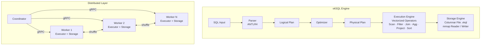
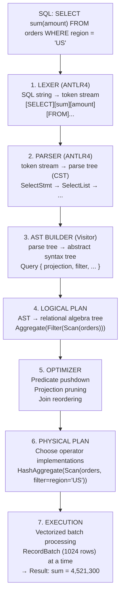
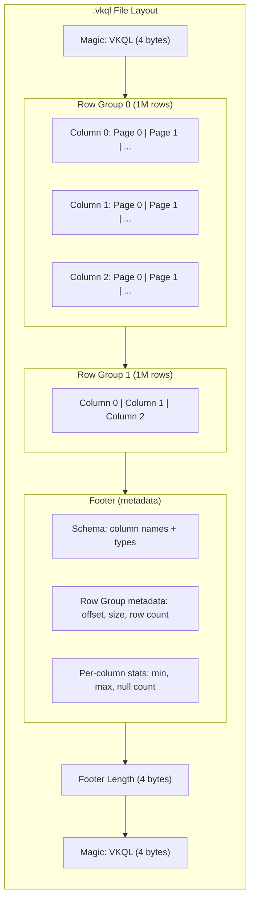
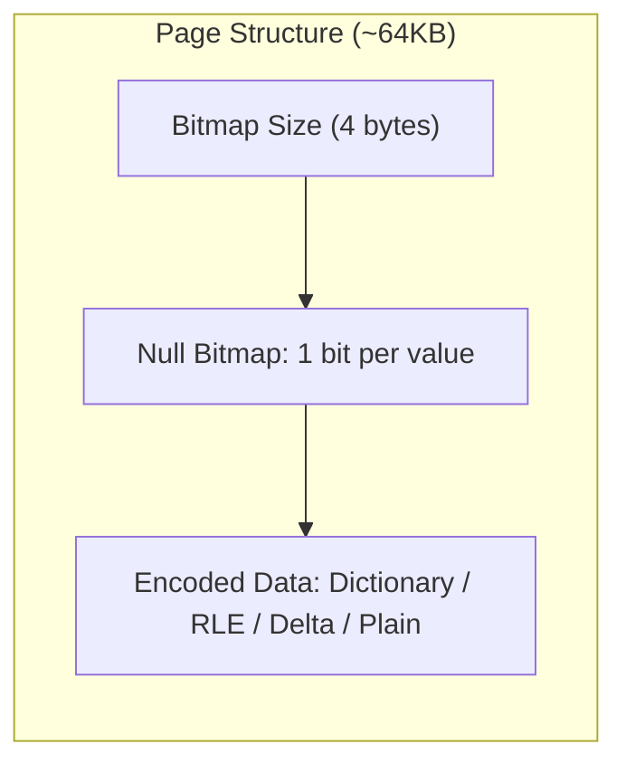
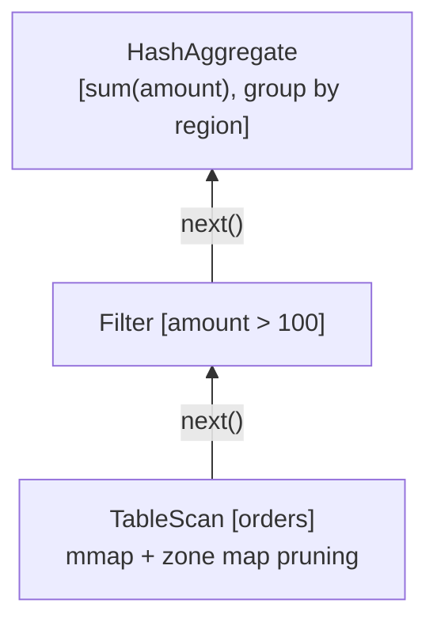
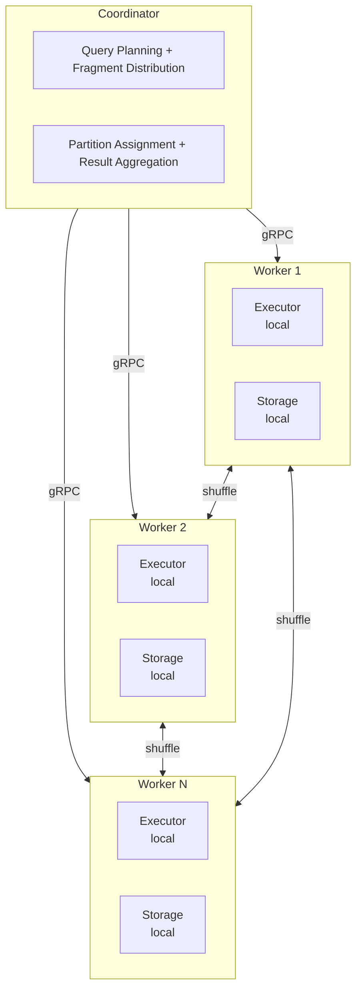
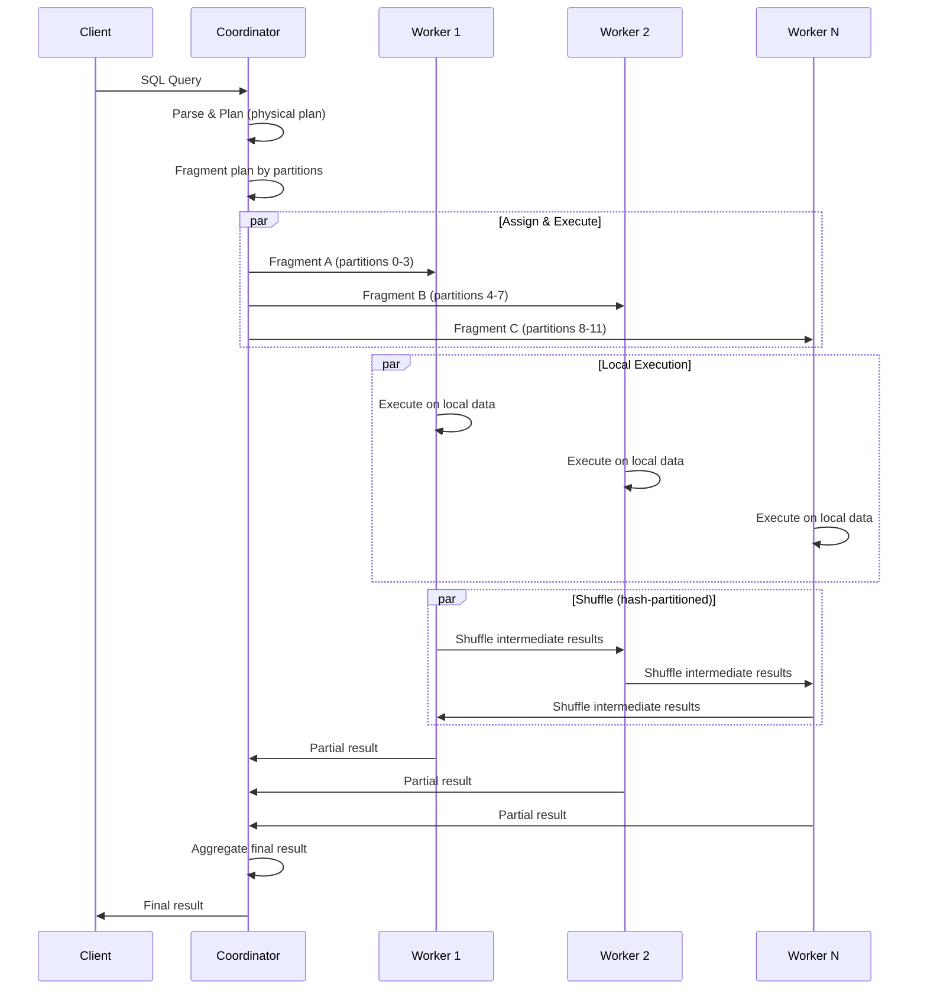
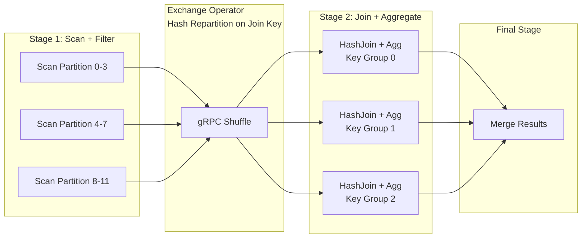
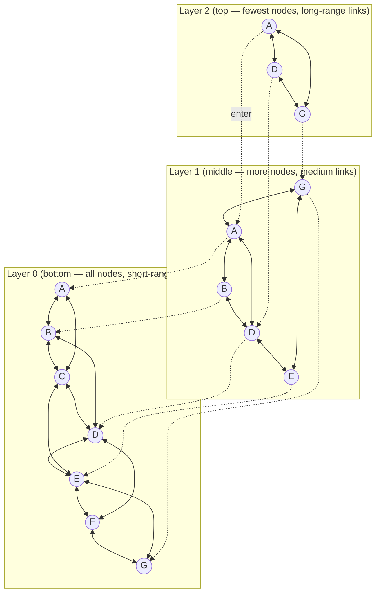

# Architecture

Detailed technical architecture of vkSQL — a distributed analytical query engine.

## System Overview



## Data Flow

### Query Processing Pipeline



## Storage Format

### File Layout

vkSQL uses a custom columnar file format (`.vkql`) optimized for analytical workloads:



### Page Structure

Each page contains a fixed number of values for a single column:



### Encoding Schemes

| Encoding | Best For | How It Works |
|----------|----------|--------------|
| **Plain** | High-cardinality data | Raw values stored sequentially |
| **Dictionary** | Low-cardinality strings | Dictionary + integer indices |
| **RLE** | Repeated values, sorted columns | Run-length: (value, count) pairs |
| **Delta** | Timestamps, sequential IDs | Store deltas between consecutive values |

### Zone Maps (Min/Max Statistics)

Every page stores min/max values for the column data it contains. During query execution, the engine checks these statistics before reading a page — if the filter predicate cannot match any value in the range `[min, max]`, the entire page is skipped.

```
Query: WHERE amount > 1000

Page 0: min=50, max=800    → SKIP (max < 1000)
Page 1: min=200, max=1500  → READ (range overlaps)
Page 2: min=1100, max=9000 → READ (range overlaps)
Page 3: min=10, max=100    → SKIP (max < 1000)
```

## Execution Engine

### Volcano vs Vectorized

Traditional databases use the **Volcano model** (iterator-based, one row at a time). vkSQL uses a **vectorized model** that processes data in batches:

| Aspect | Volcano | Vectorized (vkSQL) |
|--------|---------|-------------------|
| Unit of work | 1 row | 1024+ rows (RecordBatch) |
| Function calls | O(rows × operators) | O(batches × operators) |
| CPU cache | Poor (pointer chasing) | Excellent (sequential access) |
| SIMD potential | None | High (tight loops over arrays) |
| Branch prediction | Poor | Good (batched conditionals) |

### Operator Model

All operators implement a pull-based interface:

```java
public interface PhysicalOperator {
    RecordBatch next();  // Pull next batch of rows
    void open();         // Initialize operator state
    void close();        // Release resources
}
```

**Operator tree (pull-based pipeline):**



> Each operator pulls batches from its child by calling `next()`. Data flows upward from scan to the root operator.

### RecordBatch

The fundamental data unit in the execution engine:

```
RecordBatch (1024 rows):
┌─────────────────────────────────────────┐
│  Column Vector: "region" (String)       │
│  [US, US, EU, EU, US, JP, ...]          │
├─────────────────────────────────────────┤
│  Column Vector: "amount" (Long)         │
│  [500, 1200, 300, 800, 2000, ...]       │
├─────────────────────────────────────────┤
│  Selection Vector (optional)            │
│  [0, 1, 4, ...] (indices of valid rows) │
├─────────────────────────────────────────┤
│  Row Count: 1024                        │
└─────────────────────────────────────────┘
```

### Key Operators

- **TableScan** — reads columnar pages via mmap, applies zone map pruning, decodes/decompresses
- **Filter** — evaluates predicates on column vectors, produces selection vector
- **Project** — evaluates expressions, produces new column vectors
- **HashAggregate** — builds hash table on group keys, computes aggregate functions
- **HashJoin** — builds hash table on build side, probes with probe side
- **Sort** — external sort with spill-to-disk for large datasets

## Distributed Execution

### Architecture



### Query Execution Flow (Distributed)



### Distributed Execution Stages



### Partitioning & Shuffle

Data is hash-partitioned across workers by a partition key. For distributed joins:

```
                    Shuffle (hash on join key)
Worker 1 ─────────────────────────────────────▶ Worker 1
    │ partition(key) = 0                           │ receives all key=0
    │                                              │
Worker 2 ─────────────────────────────────────▶ Worker 2
    │ partition(key) = 1                           │ receives all key=1
    │                                              │
Worker 3 ─────────────────────────────────────▶ Worker 3
      partition(key) = 2                             receives all key=2
```

### gRPC Service Definition

```protobuf
service ShuffleService {
    rpc ExecuteFragment(FragmentRequest) returns (stream RecordBatchResponse);
    rpc SendBatch(stream RecordBatchRequest) returns (AckResponse);
    rpc Heartbeat(HeartbeatRequest) returns (HeartbeatResponse);
}
```

### Fault Tolerance

- **Heartbeat monitoring** — Coordinator detects worker failures via periodic heartbeats
- **Fragment reassignment** — Failed fragments are reassigned to healthy workers
- **Retry with backoff** — Transient failures retried with exponential backoff
- **Partial result recovery** — Completed fragments are cached, only failed work is recomputed

## HNSW Index Structure (Planned)

For the upcoming AI/ML extensions (Phase 6), vkSQL will support HNSW (Hierarchical Navigable Small World) indexing for approximate nearest neighbor vector search:



> Search begins at the top layer with long-range jumps, then descends to lower layers for finer-grained navigation. Each layer is a navigable small-world graph with increasing density.

## Performance Optimizations

### Memory-Mapped I/O

- Files are mapped into virtual memory via `MemorySegment` (Panama API)
- OS page cache handles buffering — no explicit buffer management
- Zero-copy: data is read directly from mmap'd region, no intermediate copies
- Columnar layout ensures sequential access patterns → excellent prefetching

### Vectorized Loops

Processing data in tight loops over primitive arrays enables:
- CPU cache line utilization (sequential access)
- Auto-vectorization by JIT compiler (SIMD)
- Minimal virtual dispatch overhead
- Branch-free evaluation where possible

```java
// Vectorized filter: amount > threshold
for (int i = 0; i < batch.rowCount(); i++) {
    selectionVector[i] = amounts[i] > threshold ? 1 : 0;
}
```

### Parallel Execution

- **Virtual threads** — lightweight concurrency for I/O-bound operations
- **Parallel scan** — multiple row groups scanned concurrently
- **Partitioned aggregation** — thread-local hash tables merged at the end
- **Work stealing** — idle threads pick up remaining work units

### JVM Tuning

```bash
# Recommended JVM flags
-XX:+UseZGC                    # Low-latency GC
-XX:+ZGenerational             # Generational ZGC (Java 21+)
-Xmx16g                       # Heap size for large datasets
--enable-preview               # Panama MemorySegment, virtual threads
--add-modules jdk.incubator.vector  # Vector API (experimental)
```

### Predicate Pushdown

Three levels of pushdown:

1. **File level** — skip entire files based on partition metadata
2. **Row group level** — skip row groups based on zone maps
3. **Page level** — skip individual pages based on page-level min/max

This avoids I/O entirely for data that cannot match the predicate.
